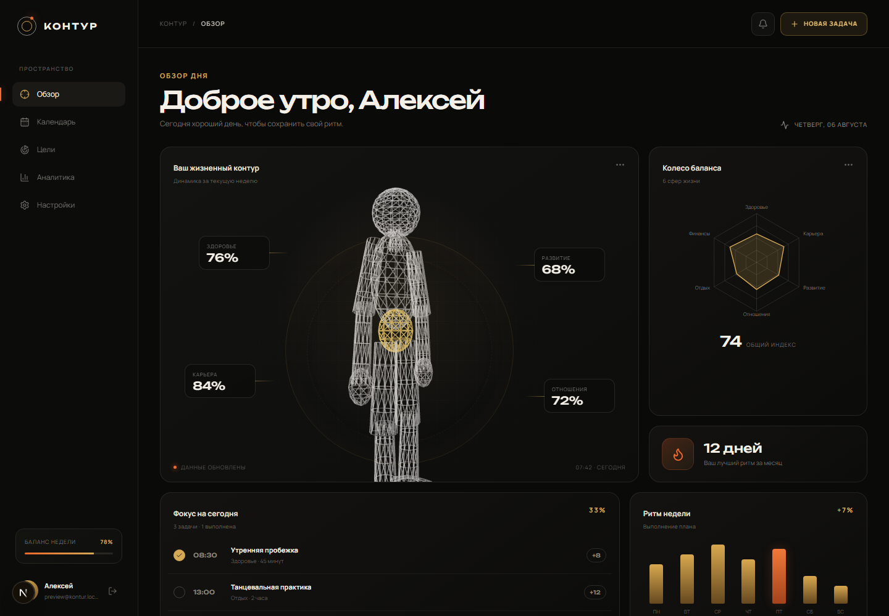
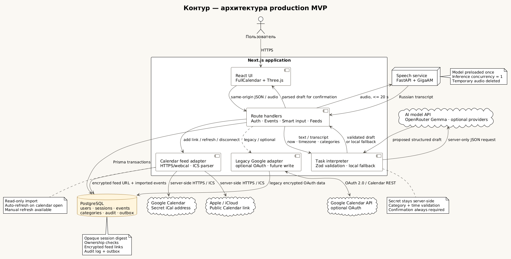

# КОНТУР.КОСТРОВ

Production-minded MVP персональной системы развития: календарь задач, колесо жизненного баланса, голосовое создание событий и импорт из Google Calendar и Apple Calendar по ссылке iCal/ICS.



## Что уже работает

- регистрация и вход по email/паролю;
- opaque server sessions: в cookie хранится случайный token, в PostgreSQL — только SHA-256 digest;
- защищённый CRUD событий, целей, шагов к ним и сфер жизни с ownership-проверками, Zod-валидацией, CSRF origin check и аудитом;
- категории жизненного баланса и расчёт недельного прогресса по формуле `минуты добавленных задач / недельная цель`;
- интерактивный FullCalendar: неделя, выбор диапазона, drag-and-drop, resize;
- обзор с программной Three.js wireframe-фигурой и radar chart;
- текстовый или голосовой ввод одной фразой, опциональный ИИ-разбор названия, относительной даты, времени и сферы жизни, локальный fallback и обязательное подтверждение;
- запись короткой голосовой команды в браузере и локальный GigaAM STT;
- отдельный FastAPI speech service: модель загружается один раз, аудио удаляется после обработки;
- read-only-подписки на Google Calendar и Apple Calendar по iCal/ICS-ссылке без пользовательских API-ключей и OAuth; ссылка шифруется на сервере, обновление запускается при открытии календаря и вручную;
- пакетная ИИ-классификация импортированных событий текущего месяца по активным сферам жизни пользователя с проверкой результата и локальным fallback;
- `AuditLog` и transactional `Outbox` для значимых изменений;
- адаптивные экраны целей, аналитики и настроек;
- migration, seed, health endpoint, Docker Compose, lint/typecheck/unit test/build.

## Стек

- Next.js 16, React 19, TypeScript, Tailwind CSS 4;
- PostgreSQL 16 + Prisma 6;
- FullCalendar Standard 6 (MIT), React Three Fiber, Recharts;
- FastAPI + GigaAM `v3_e2e_rnnt` для русского STT;
- server-only адаптер GigaChat/OpenAI-compatible API для разбора задач;
- iCalendar (ICS) feeds Google Calendar и Apple/iCloud; Google Calendar REST API сохранён для legacy OAuth-интеграции.

FullCalendar хранит только состояние UI. Источником истины для локальных данных остаётся PostgreSQL; подключённые Google/Apple-календари — внешние read-only-источники. Локальный статус `COMPLETED` и категория колеса не смешиваются с внешним событием.

## Быстрый запуск

Требования: Node.js `>=22.13`, Docker Desktop.

```powershell
Copy-Item .env.example .env
npm install
npm run docker:up
npm run db:migrate:deploy
npm run db:seed
npm run dev
```

Откройте `http://localhost:3000`.

Для demo-пользователя задайте собственные значения `SEED_DEMO_*` в `.env` до запуска seed. Не публикуйте пароль demo-аккаунта в репозитории.

PostgreSQL опубликован на `55432`, чтобы не конфликтовать с локальной установкой на стандартном `5432`.

## Цели, шаги и календарь

Модель намеренно разделяет три уровня:

- **сфера** отвечает, к какой части жизни относится намерение;
- **цель** описывает измеримый результат и срок;
- **шаг** описывает действие: повторяемое с нормой на неделю или разовый этап.

Любое локальное или импортированное событие календаря можно привязать к цели и конкретному шагу. Когда событие получает статус **Выполнено**, оно автоматически учитывается в прогрессе шага. Быстрая отметка в карточке цели создаёт выполненное событие на сегодня, поэтому история остаётся видна в календаре. Недельная граница рассчитывается по IANA timezone пользователя.

Новая учётная запись получает редактируемые стартовые примеры во всех восьми сферах. Миграция добавляет их и существующим пользователям, у которых ещё нет ни одной цели; пользовательские наборы не меняются. Примеры построены на конкретных действиях и обратной связи, а физическая активность начинается с сочетания аэробной и силовой нагрузки: [goal-setting theory](https://www.psychologicalscience.org/journals/current-directions/j.1467-8721.2006.00449.x), [implementation intentions](https://www.socmot.uni-konstanz.de/publications/implementation-intentions-and-goal-achievement-meta-analysis-effects-and-processes), [рекомендации ВОЗ](https://www.who.int/news-room/fact-sheets/detail/physical-activity).

## ИИ-разбор задачи по тексту или голосу

Кнопка **Умная задача** принимает как печатную фразу, так и голос. Например:

```text
Тренировка с тренадцати до пятнадцати послезавтра
```

Сервер передаёт модели текущее время, IANA timezone пользователя и только активные сферы жизни. Ответ повторно проверяется Zod: неизвестный `categoryId`, некорректная дата, обратный или слишком длинный диапазон не принимаются. Модель никогда не создаёт событие напрямую — пользователь сначала видит название, время и сферу и подтверждает результат. Если выбранная бесплатная модель OpenRouter временно перегружена, сервер пробует `google/gemma-4-26b-a4b-it:free`, затем `openrouter/free`; при недоступности всех ИИ-маршрутов остаётся локальный консервативный parser.

### OpenRouter + бесплатная Gemma 4 31B

Для предложенной модели [`google/gemma-4-31b-it:free`](https://openrouter.ai/google/gemma-4-31b-it:free) достаточно создать API key в [OpenRouter](https://openrouter.ai/settings/keys) и добавить его только на сервере:

```dotenv
OPENROUTER_API_KEY=sk-or-v1-...
```

Для совместимости также распознаётся `API_KEY`, но предпочтительно использовать однозначное имя `OPENROUTER_API_KEY`. После изменения `.env` или `.env.local` перезапустите `npm run dev`. ID Gemma уже является значением по умолчанию; при необходимости его можно явно закрепить через `TASK_AI_MODEL=google/gemma-4-31b-it:free`. Бесплатный каталог и доступность меняются, а базовый бесплатный аккаунт OpenRouter имеет небольшой суточный лимит, поэтому fallback намеренно остаётся частью системы.

### Другие бесплатные профили

- Для личного некоммерческого MVP в России можно указать `GIGACHAT_CREDENTIALS`: по умолчанию используется `GigaChat-2`, OAuth-токен обновляется сервером. GigaChat может потребовать сертификат НУЦ Минцифры через `NODE_EXTRA_CA_CERTS`, заданный до запуска Node.
- Для Qwen в Cloudflare Workers AI задайте `CLOUDFLARE_ACCOUNT_ID` и `CLOUDFLARE_AI_API_TOKEN`; модель по умолчанию — `@cf/qwen/qwen3-30b-a3b-fp8`.
- Для любого другого OpenAI-compatible API задайте `TASK_AI_API_KEY`, `TASK_AI_BASE_URL` и `TASK_AI_MODEL`. Loopback endpoint (`localhost`/`127.0.0.1`) разрешён без ключа, поэтому можно полностью локально поднять Qwen через vLLM/SGLang.

Не настраивайте несколько профилей одновременно. Текст задачи отправляется выбранному внешнему провайдеру; для приватных данных используйте локальную модель. Секреты не должны иметь префикс `NEXT_PUBLIC_`.

## Голосовой ввод

Для интерфейсной демонстрации без ML-сервиса установите `VOICE_DEMO_MODE=true`. Это вернёт тестовую фразу, но всё равно выполнит настоящий parser и сохранит `VoiceCommand`.

`npm run docker:up` запускает PostgreSQL и speech-сервис вместе. Если PostgreSQL уже работает, отдельно поднять только распознавание можно командой:

```powershell
docker compose --profile speech up -d speech
```

Первый build/download тяжёлый: веса GigaAM занимают около 450 МБ, а Python/Torch image заметно больше. Подробности — в [services/speech/README.md](services/speech/README.md).

Пример команды:

```text
Поставь на эту пятницу задачу, с тринадцати до семнадцати, танцы
```

Поток: запись до 20 секунд → STT → ИИ-интерпретатор или локальный parser с timezone пользователя → preview → подтверждение → атомарное создание события. Одна распознанная команда может быть применена только один раз.

## Google Calendar и Apple Calendar без OAuth

Для обычного подключения не нужны Google Cloud Console, Client ID, Client Secret или пользовательские API-ключи. Пользователь один раз вставляет ссылку подписки на весь календарь, а КОНТУР.КОСТРОВ импортирует её только для чтения. Ссылка на отдельное событие или обычное приглашение другу для этого не подойдёт.

### Google Calendar

1. В веб-версии Google Calendar откройте **Настройки → Настройки моих календарей → нужный календарь → Интеграция календаря** ([официальная инструкция Google](https://support.google.com/calendar/answer/37648?hl=ru)).
2. Скопируйте **Секретный адрес в формате iCal** (`Secret address in iCal format`). Нужна именно ссылка, заканчивающаяся на `.ics`, а не публичная HTML-страница календаря.
3. В КОНТУР.КОСТРОВ откройте **Настройки → Google и Apple Calendar**, вставьте ссылку и нажмите **Подключить**. Источник определится автоматически.

Если секретного адреса нет, администратор рабочего или учебного Google Workspace мог запретить внешние подписки. Это ограничение нужно менять на стороне Google.

### Apple Calendar / iCloud

1. В Apple Calendar или на iCloud.com включите для нужного календаря **Публичный календарь / Открытый календарь** (`Public Calendar`) ([официальная инструкция Apple](https://support.apple.com/ru-ru/guide/icloud/mm6b1a9479/icloud)).
2. Скопируйте ссылку вида `webcal://…`, вставьте её в блок **Настройки → Google и Apple Calendar** и нажмите **Подключить**. Приложение само определит Apple и использует совместимый HTTPS-вариант для серверного чтения.

У Apple слово «публичный» означает, что календарь доступен любому, кто знает эту трудноугадываемую ссылку. Поисковая публикация для этого не требуется, но саму ссылку нужно считать секретом: не отправляйте её в открытые чаты и не размещайте в репозитории.

### Обновление и безопасность

События автоматически обновляются при открытии страницы календаря; в списке подключений можно запустить синхронизацию кнопкой **Обновить**. После импорта сервер одним или несколькими пакетами анализирует события текущего календарного месяца в timezone пользователя и сопоставляет их только с его активными сферами жизни. Неизвестные `eventId` и `categoryId` из ответа модели отбрасываются, уже выбранные категории не перезаписываются, а при недоступности ИИ используется консервативное локальное сопоставление. Повторная синхронизация неизменившегося календаря не вызывает модель снова, пока не начнётся новый месяц или не изменится набор сфер.

Подписка read-only: название, время и удаление внешнего события меняются в Google/Apple, после чего подтягиваются в КОНТУР.КОСТРОВ. Локальные сфера и статус остаются только в КОНТУР.КОСТРОВ. Название, сокращённое описание, место и время импортированных событий текущего месяца передаются выбранному ИИ-провайдеру; для приватного календаря используйте локальный OpenAI-compatible endpoint.

iCal/ICS-ссылка работает как bearer-секрет. После сохранения она шифруется на сервере AES-256-GCM, не возвращается в интерфейс и не должна попадать в логи. Владельцу установки нужен один серверный ключ:

```dotenv
CALENDAR_FEED_ENCRYPTION_KEY=base64:<32 random bytes>
```

Ключ можно получить командой `openssl rand -base64 32`. Если `CALENDAR_FEED_ENCRYPTION_KEY` не задан, для совместимости используется `GOOGLE_TOKEN_ENCRYPTION_KEY`.

Существующий Google OAuth backend и его переменные окружения сохранены как legacy/optional. Для подключения по iCal они не нужны; OAuth имеет смысл развивать позже, если появится запись изменений обратно в Google Calendar.

## Команды

```powershell
npm run dev
npm run build
npm run lint
npm run typecheck
npm test
npm run db:generate
npm run db:migrate
npm run db:migrate:deploy
npm run db:seed
npm run db:studio
npm run docker:up
npm run docker:app
npm run docker:down
```

## Docker

Корневой `Dockerfile` собирает минимальный production-образ Next.js в режиме `standalone`. Полный локальный стек с PostgreSQL, автоматическим применением уже созданных миграций и приложением запускается так:

```powershell
Copy-Item .env.example .env
npm run docker:app
```

После запуска приложение доступно на `http://localhost:3000`. Speech-сервис тяжёлый и включается отдельно профилем: `npm run docker:up`. Если он не запущен, оставьте `VOICE_DEMO_MODE=true` или используйте текстовый ввод.

## Развёртывание на Vercel

Репозиторий готов к импорту в Vercel из ветки `main` как **Services**-проект. `vercel.json` разворачивает Next.js frontend и приватный speech-контейнер вместе; Vercel автоматически передаёт frontend внутренний `SPEECH_SERVICE_URL`. Потребуются внешняя PostgreSQL и серверные переменные окружения. Полная пошаговая инструкция, список обязательных секретов и порядок применения Prisma-миграций находятся в [docs/VERCEL.md](docs/VERCEL.md).

## Архитектура



Исходник схемы: [docs/architecture.puml](docs/architecture.puml). Подробные решения и границы MVP: [docs/ARCHITECTURE.md](docs/ARCHITECTURE.md).

## Что обязательно добавить перед публичным production

1. Если понадобится запись во внешние календари — OAuth write scopes, outbox worker с retries/idempotency и reconciliation.
2. Rate limiting для auth, voice и sync; Redis/очередь для тяжёлого STT.
3. Recovery flow для пароля, подтверждение email, управление активными сессиями.
4. CSP/security headers, TLS, secret manager и ротацию ключа шифрования календарных ссылок.
5. Object storage policy, если появится необходимость хранить исходное аудио; сейчас оно удаляется сразу.
6. Метрики, tracing, error reporting, backup/restore drill и нагрузочные тесты.
7. Google OAuth verification, Privacy Policy и production redirect domains — только если будет включён OAuth-сценарий.
8. E2E-тесты в CI на отдельной PostgreSQL.

## Проверки

На текущем состоянии успешно проходят:

- `npm run lint`;
- `npm run typecheck`;
- `npm test`;
- `npm run build`;
- Prisma validate/generate/migration/seed;
- живой smoke-test: login → protected overview → list/create/delete event;
- визуальная проверка desktop auth, overview и calendar.
